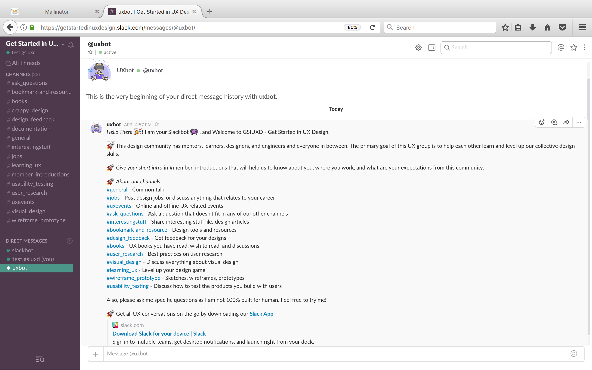
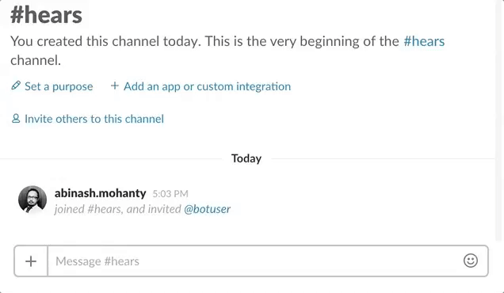
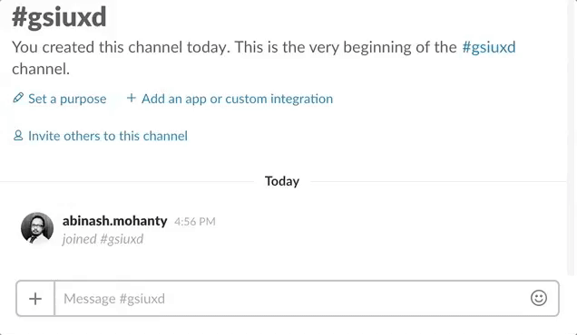

# [GSIUXD](http://www.gsiuxd.co) Slack App  

Introducing UXbot; our 1st Slack app for GSIUXD community. This is our live and production repository that's being hosted on Heroku server. Check out our [development version](#development-version) `(coming soon)`if you wanna test this slack app on your system locally. Let's look at what this slack app does.   

## UXbot Slack App
1. About UXbot
2. UXbot slack app 
3. UXbot conversations
4. UXbot slash commands

#### 1. About UXbot

UXbot is primarily designed to greet new members when they join our GSIUXD slack community.

#### 2. UXbot slack app

UXbot is a Slack app and uses OAuth 2.0, and can be added to any slack team via the slack button. 

You can [install our Slack UXbot App](https://slack-uxbot.herokuapp.com/) for you're existing slack team. However, few things to remember. Some of the logics were written specifically for our slack team, so you need to change some of the scripts/channel IDs/etc. You can always test our [development version](#development-version) `(coming soon)` as mentioned down here. 

Once, the UXbot is installed for your slack team you can interact with the bot using its `slash commands` or direct conversation. By default, UXbot would be joined your default slack channel aka `#general` channel. For the rest of the channels, you'll have to invite the bot by typing `/invite @uxbot` from a particular channel you're in. The UXbot will also listen to specific keywords from your regular conversation with other members, and we will talk about this below. 

##### Goals - Greet new members

New members will get to see the following message from `UXbot` via DM aka private message when they join our Slack's default channel called `#general`. This is one of our primary goals to inform our new members about our UX community along with our top channels as you see below.  

#### 3. UXbot conversations

##### Hear patterns

#### 4. UXbot slash commands

## UXbot development version 

If you wanna install and test this UXbot locally, just go through the following steps. 

## Join our GSIUXD Slack Community
1. Get an [invite to join](https://gsiuxd.herokuapp.com/).
2. Check your inbox, and proceed with slack's onboarding step to register your account with slack. 
1. Sign in to [GSIUXD Slack Community](https://getstartedinuxdesign.slack.com/) using desktop, mobile browser, or app.
3. That's it! Welcome to GSIUXD community. 

## UXbot Development

###### Coming soon...

Interested to test our UXbot locally? I will share its github repo with instruction soon. 

## Credits
#### Howdyai's [Botkit](https://github.com/howdyai/botkit)

